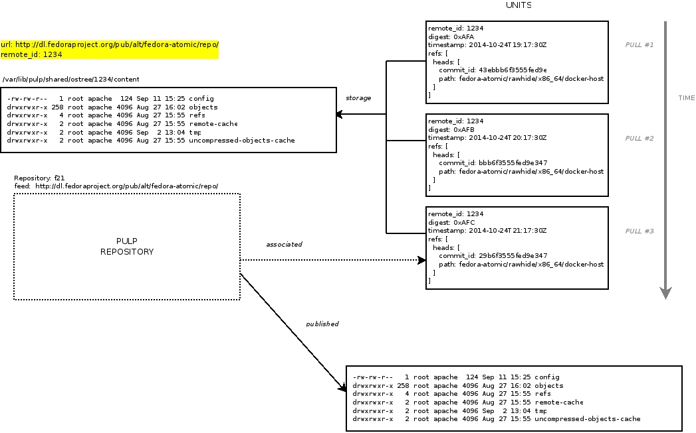

Concepts
========

An ostree content unit represents a snapshot of an ostree repository. A pulp ostree repository
may be synchronized with a :term:`remote` ostree repository. Each content unit created during
synchronization with (the same) ``remote`` shares filesystem storage. Content units contain
a snapshot of the repository's :term:`refs` and are uniquely identified by the
:term:`remote_id` and the :term:`digest` of the unit's metadata.

A Pulp ostree repository is configured with a list of branch names (or trees) which determines
which branches are pulled during synchronization with its remote.  The list of branches may
be modified after the repository has been created.

Repository ``refs`` can be added, updated and deleted.  But, content objects stored
in ``local`` repositories are immutable and cannot be deleted.  An orphaned
local repository is removed during orphan removal.

Anatomy:

